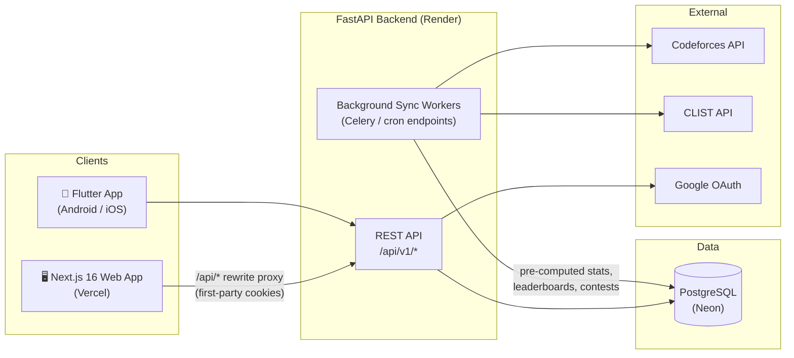

<div align="center">

# PROGNOS

### The Strava for Competitive Programming

**Aggregate your practice. Compete with your peers. Never miss a contest.**

[**Live App**](https://prognos-chi.vercel.app) · [**Download Android APK**](https://prognos-chi.vercel.app/prognos.apk) · [**API Health**](https://prognos-api.onrender.com/api/v1/health) · [**Documentation**](docs/)


</div>

---

Competitive programmers practice across scattered platforms, track streaks in their heads, and find out about contests after they start. **PROGNOS** fixes that: it pulls your Codeforces activity into one unified analytics dashboard, detects the topics you're weak in, reminds you before every contest — and puts you on a transparent leaderboard with your classmates, because nothing drives consistency like seeing your peer's 40-day streak.

## ✨ Features

### 📊 Personal Analytics
- **Unified dashboard** — rating graph, verdict breakdown, tag coverage, and a GitHub-style activity heatmap, all pre-computed server-side for instant loads.
- **Streak tracking** — current and longest daily solve streaks.
- **Skill-gap detection** — a rule-based weakness engine that flags under-practiced tags relative to your rating band and recommends what to solve next.
- **Insights page** — deeper trends: difficulty distribution, solve velocity, and progress over time.

### 🏆 Classrooms (Social Accountability)
- **Multi-tenant classrooms** — any verified user can create a classroom and invite peers with a join code.
- **Transparent leaderboards** — ranked by rating, streak, and weekly solves; recomputed by background workers, never on request.
- **Cohort analytics for mentors** — teachers see aggregate tag coverage and activity across the whole class.
- **Per-classroom roles** — be a teacher in one classroom and a student in another; roles live on the membership, not the user.

### 🗓️ Contest Discovery & Reminders
- **All judges, one calendar** — upcoming contests from Codeforces, AtCoder, LeetCode and more via the CLIST API.
- **Reliable mobile reminders** — exact alarms that survive Do-Not-Disturb, device reboots, and OEM battery killers, with a one-tap deep link to whitelist the app.

### 📱 Mobile App (Flutter)
- Full dashboard, insights, classrooms, and contest calendar on Android and iOS.
- **Offline-first** contest cache and a **home-screen widget** for your next contest.
- On-device alarm scheduling — reminders fire even with no network.

### 🔐 Secure by Design
- Google OAuth 2.0 + short-lived JWT access tokens with rotating, hashed refresh tokens.
- **Handle ownership verification** — prove a Codeforces handle is yours by setting a one-time token in your profile; no passwords ever touch PROGNOS.
- Server-side data sync only: clients can *trigger* a sync but never *write* stats, so leaderboards can't be forged.

## 🏗️ Architecture

**API-first, compute-on-write.** One FastAPI backend serves both the web and mobile apps. All heavy lifting (fetching submissions, computing streaks, ranking leaderboards) happens in background workers; frontends only read pre-computed results. That's why every page load is a handful of indexed queries — measured at **~2,000 req/s with p95 latency of 11 ms** under load (`ab -n 2000 -c 20`).



**Key decisions** (each one documented in [`docs/`](docs/)):

| Decision | Why |
|---|---|
| Clients trigger sync, server fetches | Leaderboard integrity — append-only client facts can't erase forgeries |
| Pre-compute on write, dumb reads | Sub-15 ms p95 responses; frontends never aggregate |
| Vercel rewrite proxy for the API | Refresh cookie stays first-party — works in Safari/iOS |
| Per-classroom roles | One user can mentor one cohort and compete in another |
| UUID PKs + TIMESTAMPTZ everywhere | Safe merges, no timezone bugs; clients localize |

## 🛠️ Tech Stack

| Layer | Technology |
|---|---|
| **Web** | Next.js 16 (App Router) · React 19 · TypeScript · Tailwind CSS 4 · Recharts |
| **Mobile** | Flutter · offline cache · `flutter_local_notifications` · home-screen widget |
| **API** | FastAPI · Pydantic v2 · SQLAlchemy 2.0 (async + asyncpg) · Alembic |
| **Auth** | Google OAuth 2.0 · JWT (python-jose) · rotating hashed refresh tokens |
| **Data** | PostgreSQL 15+ (Neon in production) |
| **Workers** | Celery + Redis (dev) · secured cron endpoints (production free tier) |
| **Infra** | Vercel (web) · Render Docker (API, Singapore) · cron-job.org (scheduling) |
| **Tooling** | `uv` (Python packaging) · pytest (127 tests) · GitHub |

## 🚀 Getting Started

### Prerequisites

- Python **3.12+** with [`uv`](https://docs.astral.sh/uv/)
- Node.js **20+**
- PostgreSQL **15+** running locally
- (Optional) Flutter SDK for the mobile app

### 1. Backend

```bash
cd backend
uv sync                                        # install dependencies
cp .env.example .env                           # then fill in your values
.venv/bin/python -m alembic upgrade head       # apply migrations
.venv/bin/uvicorn app.main:app --reload        # → http://localhost:8000
```

Interactive API docs are served at `http://localhost:8000/docs`.

### 2. Frontend

```bash
cd frontend
npm install
npm run dev                                    # → http://localhost:3000
```

### 3. Mobile (optional)

```bash
cd mobile
flutter pub get
flutter run
```

### 4. Verify

```bash
curl http://localhost:8000/api/v1/health       # {"status":"ok","service":"prognos-api"}
cd backend && .venv/bin/python -m pytest       # 127 passed
```

## 📁 Project Structure

```
prognos/
├── backend/            # FastAPI app — routes, models, workers, migrations
│   ├── app/
│   │   ├── api/        # REST endpoints (auth, users, analytics, contests, classrooms)
│   │   ├── core/       # config, database, security (JWT)
│   │   ├── models/     # SQLAlchemy 2.0 models
│   │   ├── schemas/    # Pydantic v2 request/response contracts
│   │   ├── services/   # business logic
│   │   └── workers/    # sync + leaderboard computation
│   ├── alembic/        # database migrations
│   └── tests/          # 127 pytest tests (unit + integration)
├── frontend/           # Next.js 16 web app (App Router, Tailwind, Recharts)
├── mobile/             # Flutter app (Android + iOS)
├── docs/               # 35+ phase docs — every decision explained
├── requirement.md      # master requirements document
└── render.yaml         # production infrastructure blueprint
```

## 🗺️ Roadmap

- [x] **V1.0** — Google auth, handle verification, personal dashboard, classrooms, contest discovery
- [x] **V1.1** — skill-gap engine, insights, on-demand sync
- [x] **V2.0** — Flutter mobile app: offline cache, reliable reminders, home-screen widget
- [ ] **V3.0** — AI coaching layer: LLM-generated practice plans from pre-formatted performance vectors
- [ ] **V3.x** — LeetCode & AtCoder connectors, cross-platform tag taxonomy

## 📖 Documentation

Every phase of this project is documented in [`docs/`](docs/) — not just *what* was built, but *why* each decision was made: schema trade-offs, auth flow design, sync strategy, free-tier deployment topology, and QA audits. Start with [`docs/phase_1_1.md`](docs/phase_1_1.md) or the [deployment plan](docs/deployment_golive_plan.md).

## 🤝 Contributing

Contributions are welcome — bug fixes, features, docs, ideas. Read [CONTRIBUTING.md](CONTRIBUTING.md) for the workflow, code style, and the contributor license agreement, then grab an open issue or propose your own.

## 📄 License

Copyright © 2026 Sudipta Das.

PROGNOS is licensed under the [GNU Affero General Public License v3.0](LICENSE) (AGPL-3.0): you're free to use, study, modify, and self-host it — but if you distribute a modified version or run one as a network service, you must open-source your changes under the same license.

---

<div align="center">

Built with discipline: design-first, one vertical slice at a time, docs after every phase.

**[Try it live →](https://prognos-chi.vercel.app)**

</div>
